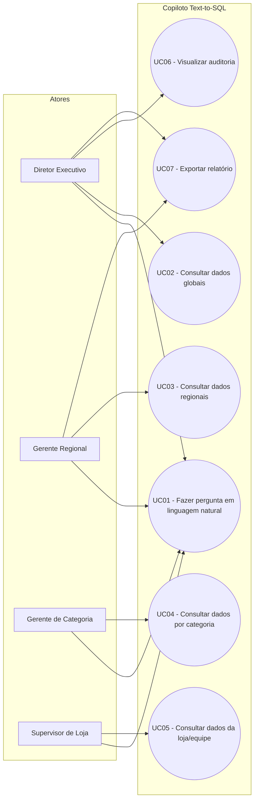
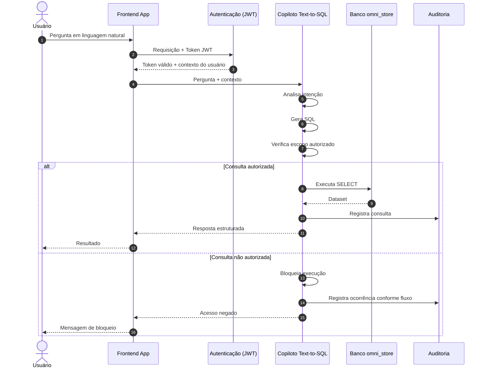

# Casos de Uso

> **Projeto:** OmniStore  
> **Documento:** Casos de Uso  
> **Objetivo:** descrever os principais comportamentos do OmniStore a partir dos perfis de acesso e dos casos de uso documentados para o Copiloto Text-to-SQL.

---

## 1. Perfis de acesso

O OmniStore considera quatro perfis de acesso para utilização do Copiloto Text-to-SQL:

| Perfil | Casos de uso associados |
|---|---|
| **Diretor Executivo** | Fazer pergunta em linguagem natural; consultar dados globais; visualizar auditoria; exportar relatórios executivos |
| **Gerente Regional** | Fazer pergunta em linguagem natural; consultar dados regionais; exportar relatórios |
| **Gerente de Categoria** | Fazer pergunta em linguagem natural; consultar dados por categoria |
| **Supervisor de Loja** | Fazer pergunta em linguagem natural; consultar dados da loja/equipe |

A associação acima corresponde ao diagrama de casos de uso atualmente documentado.

O escopo de consulta está relacionado ao contexto organizacional do usuário, representado na arquitetura por informações como `funcionarioID`, `cargoID`, `gestorID`, `lojaID` e `regiaoID`.

> **Importante:** este documento descreve os comportamentos atualmente definidos. Não são adicionadas permissões ou funcionalidades que não estejam presentes na documentação do projeto.

---

## 2. Mapa de casos de uso

O Copiloto Text-to-SQL possui os seguintes casos de uso principais:



### 2.1 Visão resumida

| ID | Caso de uso | Atores |
|---|---|---|
| UC01 | Fazer pergunta em linguagem natural | Diretor Executivo, Gerente Regional, Gerente de Categoria, Supervisor de Loja |
| UC02 | Consultar dados globais | Diretor Executivo |
| UC03 | Consultar dados regionais | Gerente Regional |
| UC04 | Consultar dados por categoria | Gerente de Categoria |
| UC05 | Consultar dados da loja/equipe | Supervisor de Loja |
| UC06 | Visualizar auditoria | Diretor Executivo |
| UC07 | Exportar relatório | Diretor Executivo, Gerente Regional |

---

## 3. UC01 — Fazer pergunta em linguagem natural

**Objetivo:** permitir que um usuário autorizado envie uma pergunta em linguagem natural ao Copiloto Text-to-SQL.

**Atores:** Diretor Executivo, Gerente Regional, Gerente de Categoria e Supervisor de Loja.

### Fluxo principal

1. O usuário acessa o Copiloto.
2. O usuário informa uma pergunta em linguagem natural.
3. A aplicação envia a requisição para a camada de autenticação.
4. O contexto do usuário é obtido a partir do token válido.
5. A pergunta e o contexto do usuário são encaminhados ao Copiloto.
6. O Copiloto analisa a intenção da pergunta.
7. O Copiloto gera a consulta SQL correspondente.
8. A consulta é verificada em relação ao escopo autorizado.
9. Se a consulta estiver autorizada, ela é executada no banco.
10. Os dados retornados são processados pelo Copiloto.
11. A resposta estruturada é apresentada ao usuário.
12. A consulta é registrada na auditoria.

### Pós-condição

Uma resposta é apresentada ao usuário quando a consulta é autorizada e executada.

A consulta também é registrada na estrutura de auditoria prevista pelo projeto.

### Fluxos alternativos e exceções

**A1 — Consulta fora do escopo**

1. A consulta é identificada como incompatível com o escopo do usuário.
2. A execução do SQL é bloqueada.
3. A tentativa não autorizada é contabilizada.
4. Enquanto o contador estiver abaixo de três tentativas, é apresentada a mensagem de acesso negado ao escopo solicitado.

**A2 — Terceira tentativa não autorizada**

1. O contador de tentativas atinge três ocorrências.
2. O acesso do colaborador é temporariamente bloqueado.
3. É gerado um registro de auditoria com status `SUSPICIOUS_BLOCK`.
4. É enviado um alerta por e-mail ao gestor direto.

> As regras de bloqueio são detalhadas no documento `01-contexto-e-requisitos.md`. Este documento apenas as referencia para manter a descrição do caso de uso completa.

---

## 4. UC02 — Consultar dados globais

**Objetivo:** permitir ao Diretor Executivo consultar dados em escopo global.

**Ator:** Diretor Executivo.

### Fluxo principal

1. O Diretor Executivo realiza uma pergunta em linguagem natural.
2. O sistema autentica a requisição.
3. O contexto do usuário é encaminhado ao Copiloto.
4. O Copiloto traduz a pergunta para uma consulta SQL.
5. A consulta é avaliada em relação ao escopo autorizado.
6. A consulta autorizada é executada.
7. Os dados são retornados ao Copiloto.
8. O resultado é estruturado e apresentado ao Diretor Executivo.
9. A consulta é registrada na auditoria.

### Exemplo documentado

O fluxo arquitetural utiliza como exemplo uma pergunta relacionada ao faturamento de uma loja em determinado período.

### Fluxos alternativos e exceções

Uma consulta que viole o escopo autorizado segue o fluxo de bloqueio definido para o Copiloto.

---

## 5. UC03 — Consultar dados regionais

**Objetivo:** permitir ao Gerente Regional consultar dados relacionados ao seu escopo regional.

**Ator:** Gerente Regional.

### Fluxo principal

1. O Gerente Regional realiza uma pergunta em linguagem natural.
2. A requisição é autenticada.
3. O contexto do usuário é encaminhado ao Copiloto.
4. O Copiloto gera a consulta SQL correspondente.
5. O escopo da consulta é verificado.
6. A consulta autorizada é executada.
7. O resultado é processado e apresentado ao usuário.
8. A consulta é registrada na auditoria.

### Fluxos alternativos e exceções

Caso a consulta ultrapasse o escopo regional autorizado, a execução é bloqueada e segue o fluxo de tentativa não autorizada definido no projeto.

---

## 6. UC04 — Consultar dados por categoria

**Objetivo:** permitir ao Gerente de Categoria consultar dados relacionados ao escopo de categoria.

**Ator:** Gerente de Categoria.

### Fluxo principal

1. O Gerente de Categoria realiza uma pergunta em linguagem natural.
2. A requisição é autenticada.
3. O contexto do usuário é encaminhado ao Copiloto.
4. O Copiloto gera a consulta SQL.
5. O escopo da consulta é verificado.
6. A consulta autorizada é executada.
7. O resultado é apresentado ao usuário.
8. A consulta é registrada na auditoria.

### Fluxos alternativos e exceções

Caso a consulta ultrapasse o escopo autorizado, a execução é bloqueada e o fluxo de tentativa não autorizada é aplicado.

---

## 7. UC05 — Consultar dados da loja/equipe

**Objetivo:** permitir ao Supervisor de Loja consultar dados relacionados à sua loja/equipe.

**Ator:** Supervisor de Loja.

### Fluxo principal

1. O Supervisor de Loja realiza uma pergunta em linguagem natural.
2. A requisição é autenticada.
3. O contexto do usuário é encaminhado ao Copiloto.
4. O Copiloto gera a consulta SQL.
5. O escopo da consulta é verificado.
6. A consulta autorizada é executada.
7. O resultado é apresentado ao usuário.
8. A consulta é registrada na auditoria.

### Fluxos alternativos e exceções

Caso a consulta ultrapasse o escopo autorizado, a execução é bloqueada e o fluxo de tentativa não autorizada é aplicado.

---

## 8. UC06 — Visualizar auditoria

**Objetivo:** permitir ao Diretor Executivo visualizar a auditoria das consultas realizadas pelo Copiloto.

**Ator:** Diretor Executivo.

### Fluxo principal

1. O Diretor Executivo acessa a funcionalidade de auditoria.
2. O sistema verifica a autenticação e o perfil do usuário.
3. O sistema disponibiliza os registros de auditoria autorizados.

A estrutura de auditoria documentada contempla informações como:

- identificador da consulta;
- funcionário responsável;
- pergunta realizada;
- SQL gerado;
- status da consulta;
- motivo de negativa;
- tempo de execução;
- data e hora da consulta.

### Fluxos alternativos e exceções

A documentação disponível não especifica fluxos adicionais para falhas ou indisponibilidade da auditoria.

---

## 9. UC07 — Exportar relatório

**Objetivo:** permitir a exportação de relatórios executivos pelos perfis autorizados.

**Atores:** Diretor Executivo e Gerente Regional.

### Fluxo principal

1. O usuário autorizado acessa a funcionalidade de exportação.
2. O sistema verifica a autenticação e o perfil do usuário.
3. O relatório é disponibilizado para exportação.

### Fluxos alternativos e exceções

A documentação disponível não especifica o formato dos arquivos exportados, os filtros disponíveis ou os tratamentos para falha durante a exportação.

Esses detalhes permanecem como pontos a serem definidos.

---

## 10. Fluxos principais

Os casos de uso compartilham um fluxo arquitetural comum para as consultas realizadas pelo Copiloto:



### 10.1 Fluxo de segurança

O fluxo de segurança documentado é:

```text
Usuário envia pergunta
        ↓
Análise da pergunta e extração do escopo
        ↓
A consulta viola o escopo autorizado?
       / \
     Não  Sim
      ↓     ↓
Executa   Bloqueia SQL
consulta     ↓
      ↓   Incrementa contador
Retorna      ↓
resposta  contador >= 3?
             / \
           Não  Sim
            ↓    ↓
      Acesso negado  Bloqueio temporário
                       ↓
                   Auditoria
                       ↓
                Alerta ao gestor
```

O detalhe das regras de negócio permanece no documento `01-contexto-e-requisitos.md`, evitando duplicação entre documentos.

---

## 11. Fluxos alternativos e exceções

Os principais fluxos alternativos atualmente documentados são relacionados ao controle de acesso.

### 11.1 Consulta fora do escopo

Quando uma consulta viola o escopo autorizado:

1. o SQL não é executado;
2. a tentativa é contabilizada;
3. o usuário recebe uma mensagem de acesso negado enquanto o limite de tentativas não foi atingido.

### 11.2 Três tentativas não autorizadas

Quando o contador atinge três tentativas:

1. o acesso do colaborador é temporariamente bloqueado;
2. é gerado registro de auditoria com status `SUSPICIOUS_BLOCK`;
3. é enviado alerta por e-mail ao gestor direto.

### 11.3 Comportamentos ainda não especificados

A documentação disponível não define detalhadamente:

- duração do bloqueio temporário;
- procedimento de desbloqueio;
- momento em que o contador de tentativas é zerado;
- tratamento de erro de comunicação com o banco;
- tratamento de falha na geração de SQL;
- tratamento de falha no envio do alerta;
- comportamento diante de perguntas que o Copiloto não consiga traduzir para SQL;
- formato e filtros dos relatórios exportados.

Esses pontos devem permanecer como **lacunas de especificação**, e não como comportamentos assumidos.

---

## 12. Relação com as regras de negócio

As regras de negócio não são repetidas integralmente neste documento.

Este documento utiliza as regras apenas quando elas são necessárias para explicar um fluxo de caso de uso, principalmente nos cenários de autorização e bloqueio.

A fonte de referência para as regras consolidadas é:

> `01-contexto-e-requisitos.md` — seção **8. Regras de negócio**.

Essa separação evita que a mesma regra seja mantida em dois lugares diferentes e posteriormente fique inconsistente.

---

## 13. Lacunas de especificação

Os casos de uso estão suficientemente definidos para representar os principais comportamentos documentados do Copiloto, mas ainda existem pontos que precisam de decisão antes de serem tratados como especificações completas.

Entre eles:

- detalhamento dos critérios de aceitação de cada caso de uso;
- definição do formato de exportação dos relatórios;
- definição do comportamento para erros técnicos;
- definição do ciclo de vida do bloqueio temporário;
- detalhamento da implementação do controle de acesso no banco;
- definição de comportamentos para perguntas inválidas ou não suportadas.

Essas lacunas devem ser resolvidas posteriormente conforme o projeto evoluir.

---

## 14. Referência dos artefatos

Este documento deriva dos seguintes elementos já documentados no projeto:

- diagrama de casos de uso e perfis de acesso;
- fluxo de segurança e bloqueio;
- diagrama de arquitetura e fluxo de dados;
- modelo de auditoria;
- requisitos consolidados em `01-contexto-e-requisitos.md`.

O documento descreve o **comportamento esperado/documentado** do sistema e não deve ser interpretado como evidência de que todas essas funcionalidades já foram implementadas.
