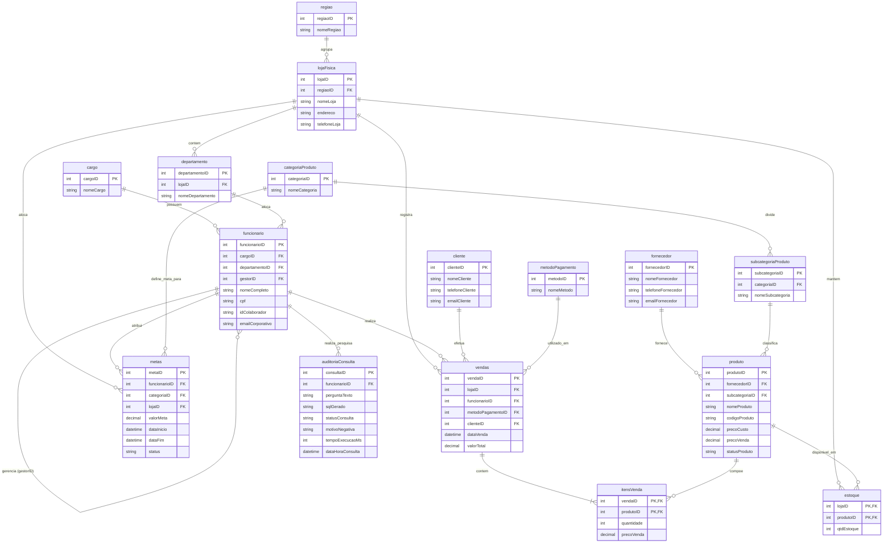
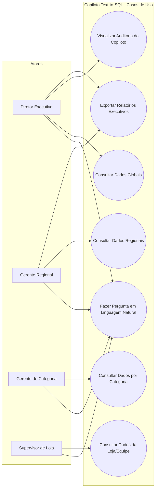
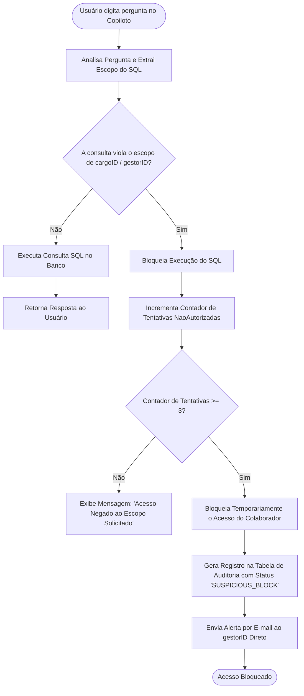
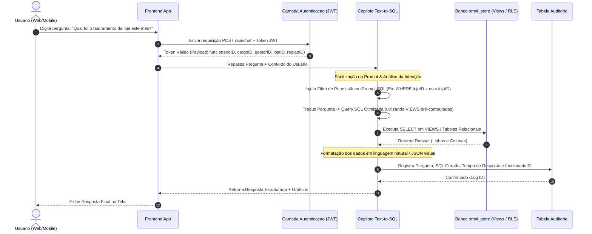

# Documentação Técnica - OmniStore & Copiloto Text-to-SQL

**Autor:** Erique Guida  
**Projeto:** OmniStore  
**Data:** 2026  

---

## 1. Diagrama de Entidade e Relacionamento (DER/MER)

---

## 2. Diagrama de Caso de Uso e Perfis de Acesso

### A. Casos de Uso

### B. Fluxo de Segurança e Bloqueio de Acesso

---

## 3. Diagrama de Arquitetura e Fluxo de Dados

